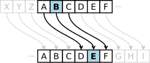

# Cifrado César.

###### En criptografía, el cifrado César, también conocido como cifrado por desplazamiento, código de César o desplazamiento de César, es una de las técnicas de cifrado más simples y más usadas.

### ¿En qué consiste el cifrado César?

Es un tipo de cifrado por sustitución en el que una letra
en el texto original es reemplazada por otra letra que se
encuentra un número fijo de posiciones más adelante en el
alfabeto. Por ejemplo, con un desplazamiento de 3, la A sería
sustituida por la D (situada 3 lugares a la derecha de la A),
la B sería reemplazada por la E, etc. Este método debe su
nombre a Julio César, que lo usaba para comunicarse con sus
generales.

## Instrucciones del trabajo a realizar:

Crear una web que por medio de un prompt pida una frase
al usuario y devuelva el mismo mensaje encriptado según el algoritmo de Cifrado César con el parámetro de desplazamiento de 33 espacios hacia la derecha

Por ejemplo:

Texto original: ABCDEFGHIJKLMNOPQRSTUVWXYZ

Texto codificado: HIJKLMNOPQRSTUVWXYZABCDEFG

### Consideraciones Específicas.

Tu programa debe ser capaz de cifrar y descifrar tanto letras mayúsculas como minúsculas. La fórmula para descifrar es: (x - n) % 26

Tu código debe estar compuesto por 2 funciones con los siguientes nombres: cipher y decipher

El usuario no debe poder ingresar un campo vacío o que contenga números

## Pseudocodigo.

Proceso: Cifrado César.

Autor: Karla Martínez.

##### INICIO:

1. Pedir al usuario por medio de prompt(), un 'string'
que vamos a "encriptar" por medio del cifrado César.

2. Crear la funcion cipher.

3. Verificar que el usuario no haya ingresado un string vacio.
if(var del prompt.length === 0) si es asi, regresar un alert y return;
para que se salga del if.

4. Cambiar el string a mayúsculas para que me sirva la formula del cifrado con el codigo ASCII con las letras en mayúsculas.
y asignar una variable con el mensaje final otorgado por el usuario en una variable vacia ''
a la que voy a llamar var finalMsg = '';.

5. Verificar que el string dado por el usuario no tenga números.
esto lo haré por medio de un ciclo for para verificar caracter por caracter
y creando una variable para almacenar el caracter que este en turno, posteriormente
por medio de un If agregare los numeros singulares del 1 al 9 para compararlos con el
caracter en turno, si es un número, se detiene la función ya que no puede haber numeros
en el string dado por el usuario. En caso de que esto suceda, regresar un alert,
para que el usuario sepa que no debe ingresar números.

6. Asignar una variable que almacene el codigo ASCII.(asciiCharCode = variable del prompt.charCodeAt(i);)

7. Asignar una variable que almacene el numero de espacios a recorrer (33).

8. Asignar una variable con la formula del cifrado César
var newCharCode = ((variable con el codigo ASCII - 65 + variable con el total de espacio) % 26) + 65;

9. Darle el valor a la variable vacia finalMsg + la función para convertir del codigo ASCII a una letra normal.
 finalMsg = finalMsg + String.fromCharCode(newCharCode);

10.   return finalMsg;

11. Crear la función descipher
Esta función trabaja igual que la función cipher, con la unica diferencia
que en lugar de sumar el numero de espacios, se tienen que restar, en lugar de sumar.
Por lo que solo hay que cambiar el signo + por el signo - en la formula de cifrado César.

##### FIN
